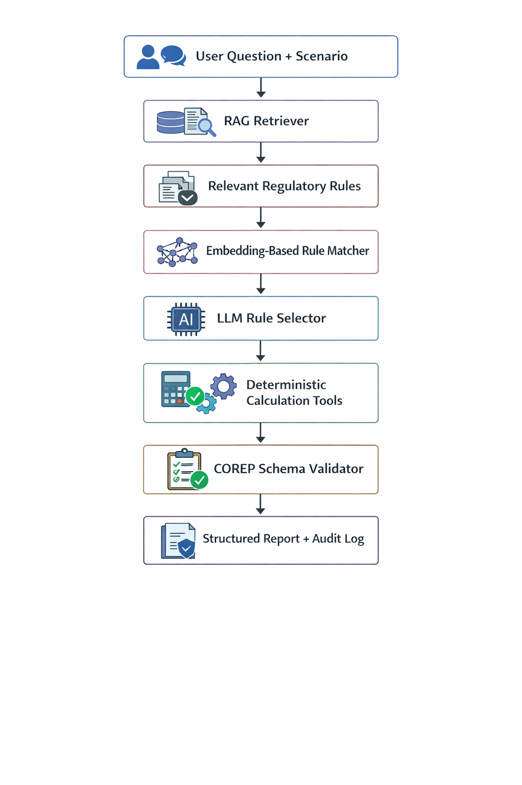
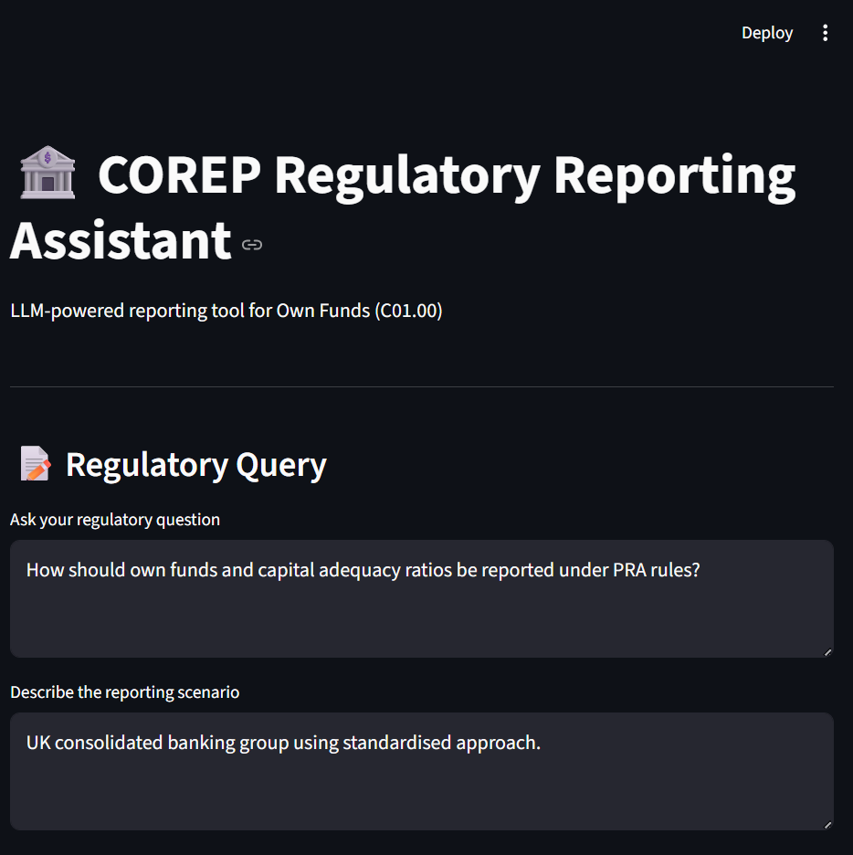
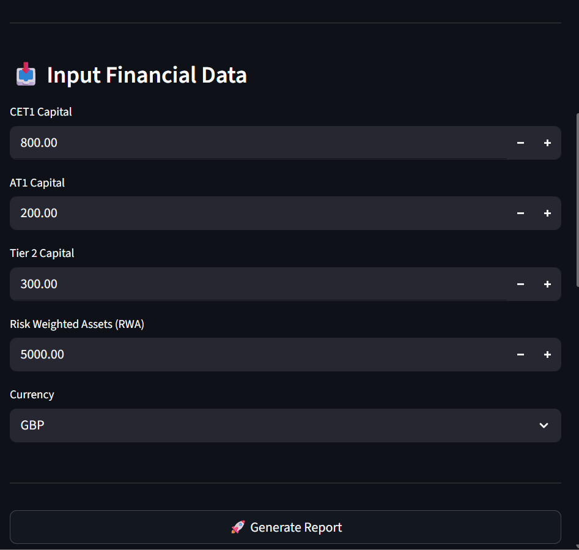
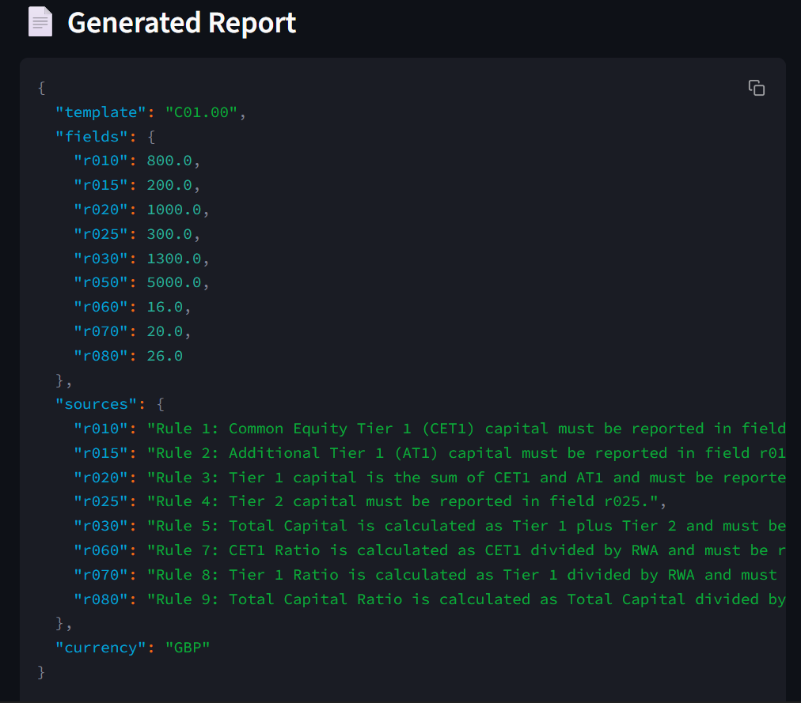
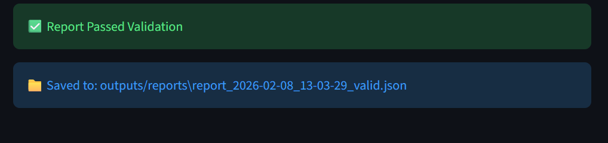

## 🏦 LLM-Assisted PRA COREP Reporting Assistant (Prototype)

An AI-assisted regulatory reporting prototype that helps banks prepare COREP Own Funds (C01.00) returns by combining retrieval-augmented generation (RAG), semantic rule matching, and deterministic calculations.

This system demonstrates how large language models can be safely used in regulated financial reporting by grounding outputs in regulatory text and enforcing structured, auditable results.

---

## 📌 Problem Context

UK banks subject to the PRA Rulebook must submit COREP regulatory returns that accurately reflect:

- Own Funds (CET1, AT1, Tier 2)
- Capital adequacy ratios
- Risk-weighted assets (RWA)

Preparing these returns is:

- Labour-intensive
- Error-prone
- Dependent on interpreting dense regulatory text

This prototype explores how LLMs can assist analysts without compromising accuracy, auditability, or regulatory explainability.

---

## 🎯 Scope of the Prototype

- Focused on COREP C01.00 – Own Funds
- Supports:
    - CET1, AT1, Tier 1, Tier 2
    - Total Capital
    - CET1 / Tier 1 / Total Capital Ratios
- Designed to be jurisdiction-agnostic (rules are not hardcoded)

---

## 🧠 Key Design Principles

### 1️⃣ No Hardcoded Regulations

All regulatory references are retrieved dynamically from a rule corpus using RAG.
This allows the system to adapt to different jurisdictions or updated rulebooks.

### 2️⃣ Reduced Hallucination via Semantic Matching

Instead of letting the LLM freely “guess” which rule applies, we:

- Pre-match reporting fields to rules using embedding similarity

- Constrain the LLM to select only from these candidates

### 3️⃣ Deterministic Financial Calculations

All numeric computations (Tier 1, Total Capital, ratios) are handled by explicit tools, not by the LLM.

### 4️⃣ Auditability by Design

Every populated field is linked to a specific regulatory rule, producing a clear audit trail.

---

## 🏗️ System Architecture
High-Level Flow

```bash
flowchart TD
    A[User Question + Scenario] --> B[RAG Retriever]
    B --> C[Relevant Regulatory Rules]
    C --> D[Embedding-Based Rule Matcher]
    D --> E[LLM Rule Selector]
    E --> F[Deterministic Calculation Tools]
    F --> G[COREP Schema Validator]
    G --> H[Structured Report + Audit Log]
    H --> I[Streamlit UI Output]
```
---

## 🧩 Architecture Explanation

1. User Input
- Natural language question
- Reporting scenario
- Financial figures (CET1, AT1, Tier2, RWA)

2. RAG Retrieval
- Regulatory rules are chunked, embedded, and retrieved based on semantic similarity.
3. Embedding-Based Rule Matching
- Each COREP field (e.g., CET1 Ratio) is matched to the most relevant rule using cosine similarity.
- This step reduces LLM hallucination.
4. LLM (Constrained Role)
- Selects the most appropriate rule from pre-matched candidates.
- Formats structured JSON output.
- Does not perform calculations.
5. Deterministic Tools
- Capital aggregation and ratio calculations are handled programmatically.
6. Validation & Audit Logging
- Outputs are validated against a predefined COREP schema.
- Each field records its regulatory justification.
 7. Frontend UI
- Streamlit interface for data entry and report visualization.
---
## ▶️ Usage
### 1. Environment Setup
Create and activate a virtual environment:
```bash
python -m venv venv
source venv/bin/activate   # Linux/Mac
venv\Scripts\activate      # Windows
```
Install dependencies:
```bash
pip install -r requirements.txt
```
---
### 2. Run the Application

Start the Streamlit interface:
```bash
streamlit run frontend/app.py
```
The application will be available at:
```bash
http://localhost:8501

```

---
### 3. Provide Input Data

In the web interface:
    1. Enter a natural-language regulatory question.
    2. Describe the reporting scenario.
    3. Provide financial values:
        - CET1 Capital
        - AT1 Capital
        - Tier 2 Capital
        - Risk-Weighted Assets (RWA)
    4. Select reporting currency.
    5. Click Generate Report.

---

### 4. Generate COREP Report

After submission, the system will:
    1. Retrieve relevant regulatory rules.
    2. Match rules to reporting fields.
    3. Compute derived values.
    4. Validate the output.
    5. Generate an auditable COREP report.

The final report is displayed in JSON format and saved locally.

---
### 5. Example Test Case

Question
```bash
How should own funds and capital adequacy ratios be reported under PRA rules?
```

Scenario
```bash
UK consolidated banking group using standardised approach.
```
Inputs
```bash
CET1  = 800
AT1   = 200
Tier2 = 300
RWA   = 5000
```
---
### 6. Output Location
Generated reports are stored in:
```bash
outputs/reports/
```
Each file includes:
- Structured COREP fields
- Regulatory sources
- Validation status

---

## 🖥️ User Interface
- Streamlit Frontend Features:
- Natural language regulatory query input
- Scenario description
- Financial data entry
- Structured JSON report output
- Validation status
- Saved report artifact

### 📸 Screenshot placeholder 

--- 





## 📄 Example Output (C01.00 Extract)
```bash
{
  "template": "C01.00",
  "fields": {
    "r010": 800.0,
    "r015": 200.0,
    "r020": 1000.0,
    "r025": 300.0,
    "r030": 1300.0,
    "r050": 5000.0,
    "r060": 16.0,
    "r070": 20.0,
    "r080": 26.0
  },
  "sources": {
    "r010": "Rule 1: Common Equity Tier 1 (CET1) capital must be reported in field r010.",
    "r015": "Rule 2: Additional Tier 1 (AT1) capital must be reported in field r015.",
    "r020": "Rule 3: Tier 1 capital is the sum of CET1 and AT1 and must be reported in field r020.",
    "r025": "Rule 4: Tier 2 capital must be reported in field r025.",
    "r030": "Rule 5: Total Capital is calculated as Tier 1 plus Tier 2 and must be reported in field r030.",
    "r060": "Rule 7: CET1 Ratio is calculated as CET1 divided by RWA.",
    "r070": "Rule 8: Tier 1 Ratio is calculated as Tier 1 divided by RWA.",
    "r080": "Rule 9: Total Capital Ratio is calculated as Total Capital divided by RWA."
  },
  "currency": "GBP"
}

```
## 🧪 Testing Strategy
- Unit Tests
    - Capital calculations
    - Field mapping
    - Validation logic
- End-to-End Tests
    - Full pipeline from input → report → audit

## 🚀 Future Enhancements

- Support additional COREP templates (e.g., capital requirements)
- Plug-and-play regulatory datasets (EU, Basel, local regulators)
- Export to Excel/XBRL
- Enhanced explainability UI (rule highlights)
- Threshold-based compliance warnings

## ✅ Summary

- This prototype demonstrates how LLMs can be safely integrated into regulated financial reporting by:
- Grounding reasoning in regulatory text
- Separating reasoning from computation
- Enforcing structure and validation
- Providing full auditability

It is intentionally scoped, modular, and designed for extensibility.

